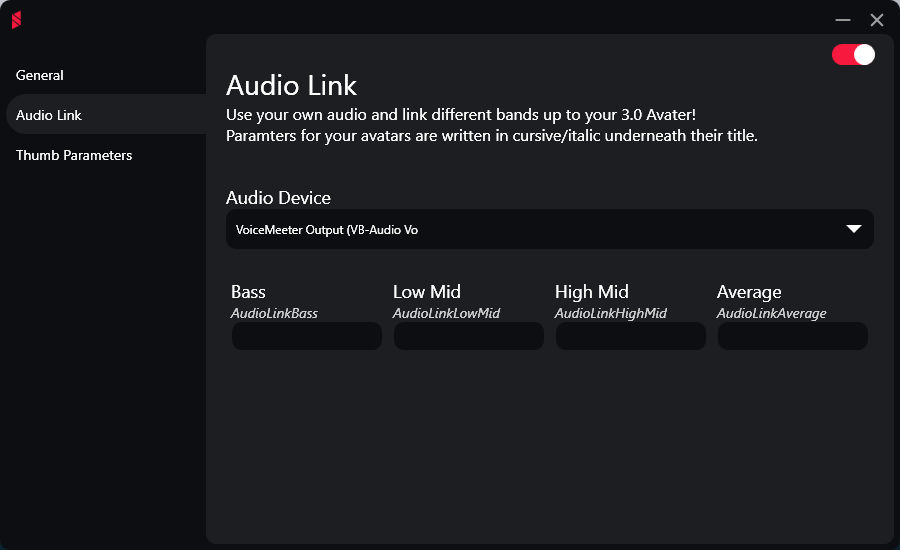

# ROSC
A bundle of cool things for VRChat to enhance the creativity of and possibilities of avatars.

Very much in an early stage.

# Personal Audio Link
The AudioLink shader for avatars is an amazing thing which really enhance the visuals of an avatar when clubbing in VRChat or experiencing other worlds.
This module provides a way for you to enhance your avatar and hook into your audio output (through something like VoiceMeeter) and create custom animations for your avatar controlled by the `float` parameters provided by the module.

*Add demo*

# Thumb Parameters
Mainly created for the Sign language commmunity to give the ability of extra animation triggers based on your thumb position on your controller (Quest 2 & Valve Index).
This can ofc. be used to do whatever since it's just two `Int` parameters. Quest animation controller for avatars currently in the works.
Heavily inspired by things created by the community <3

*Add table of `Int` layout*